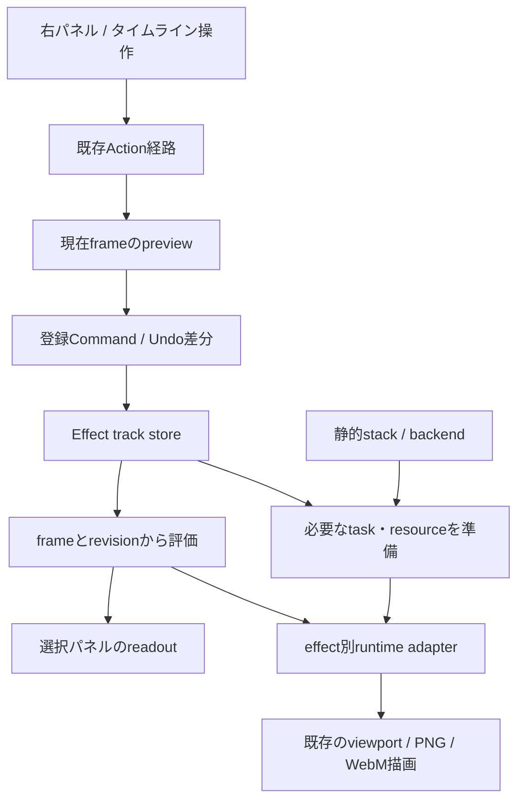

# エフェクト単位のタイムライン共通基盤：設計・見積もり

更新日: 2026-09-14
状態: 設計案。今回の作業は設計・見積もりまでで、以下の共通基盤は未実装。

## 1. 結論と対象

タイムライン全体の作り直しは不要。ガンマで通したscene track、登録Command、コピー・削除・Undo / Redo、project保存、描画前評価を流用する。エフェクトごとの登録値と描画反映だけを小さな定義・adapterへ分離する。

下準備の完了までを**10〜18時間、余裕を含め14〜24時間**と見積もる。1人で順に作業する実作業時間で、8時間換算で通常1.25〜2.25人日。初稿の12〜20時間から、所有者指定により未配布の旧ガンマキー形式への互換対応・検証を除いた。新形式の保存、UI同期、両backend、第二のエフェクトによる検証は含む。自動テストの実行時間だけや、agentの応答速度を日数換算したものではない。

所有者が明示したこと:

- 海は没。再公開・タイムライン化の対象から外す。
- 残るエフェクトはできれば全てキー化したい。
- 登録単位はエフェクトごとでよい。
- ガンマキーは開発環境でのみ使用しているため、旧ガンマキー形式の互換対応は不要。新形式へ一本化する。

本書で提案すること:

- カメラモードで1エフェクト1行。1キーにはON / OFFと、そのエフェクトでキー化を許可した設定値をまとめる。
- 最初は線形・step・ガンマの既存スライダー補間。任意ベジェ、パラメータ別の子行、外部shaderの任意変数は追加しない。
- 「全エフェクトへの対応」と「品質・asset選択を含む全設定のキー化」を分ける。各効果の対応項目を明示し、未対応の値を黙って登録しない。
- 最初の対象集合は既存stackの21 IDから海を除いた20種。stack外の露出・コントラスト・色調・フォグ等は登録定義を追加できる構造にし、今回の20種に含めた完了報告はしない。AA、材質プリセット、影generator設定はこの基盤の対象外。

## 2. 現行コードから使えるものと変更点

| 現行箇所 | 流用するもの | 下準備で変えるもの |
| --- | --- | --- |
| `src/editor/scene-keyframe-track.ts` | frame正規化、挿入・移動・削除、区間評価 | 基本構造は維持。effect用の区間検索・キャッシュが必要なら専用helperへ置く |
| `src/editor/gamma-scene-track.ts` | enabledのstep、gammaの対数空間補間、値の正規化 | effect定義へ統合し、旧キー保存形式は廃止する |
| `src/editor/timeline-edit-service.ts` | camera scope、各キー操作の共通入口 | gamma等を20カテゴリへ増やさず、effectカテゴリ1個からstoreへ委譲 |
| `src/ui-controller.ts` / `src/actions/` | Action、keyframe diff、history | 登録・capture・clone・互換判定をeffect共通にする。効果別switchを増やさない |
| `src/mmd-manager.ts` | scene track評価点、backend初期化、export連携 | store所有とadapter呼び出しに留め、gamma固有の評価・資源維持分岐を移す |
| `src/project/project-serializer.ts` / importer | 静的effect設定を復元した後のtrack復元 | 新しい汎用保存ブロックだけを読み書きする |
| `src/automation/keyframe-schema.ts` | GUIと同じ編集経路への入力検証 | effect payloadへ統一し、開発中のgamma専用キー入力を置換。互換alias・新ツールは増やさない |
| `src/timeline.ts` | 可視行描画、選択、レイヤ別更新 | effectの内部IDから表示名を引く。毎フレーム行・キー配列を再生成しない |

現行Commandはtrackの`category + name`を識別に使い、コピー時にもこの2値を保持する。新しい必須`effectId`フィールドを全track参照へ足すより、effectカテゴリの`name`を安定IDとして扱う方が小さく接続できる。

## 3. 共通部分の責務

候補ファイル名。既存の近いhelperが使える場合は統合し、ファイル数そのものは要件にしない。

| 配置案 | 責務 | 持たせないもの |
| --- | --- | --- |
| `src/editor/effect-keyframe-definitions.ts` | ID、値型、初期値、範囲、補間種別、対応backend、キー化可否 | DOM、Babylon、動的な任意propertyアクセス |
| `src/editor/effect-scene-track-store.ts` | base、keys、frame評価、revision、キー編集 | 描画資源、UI、ファイルIO |
| `src/project/effect-track-serialization.ts` | 新形式のversion検証、不正値正規化、未知データ保持 | runtime設定変更、旧gamma変換 |
| `src/render/effect-keyframe-runtime.ts` | 評価値から描画設定への反映、必要処理の準備、backend別adapter | 履歴操作、キー書換え、UIイベント |
| `src/ui/effect-keyframe-controller.ts` | 行選択、既存パネルとの橋渡し、登録状態・値表示 | 独自の描画計算、別のキー正本 |

型の概念例:

```ts
type EffectValueById = {
    gamma: { enabled: boolean; gamma: number };
    grain: { enabled: boolean; intensity: number };
    bloom: { enabled: boolean; weight: number; threshold: number };
    // 各効果の許可した値だけ追加する。
};
type EffectKeyframePayload = {
    [K in keyof EffectValueById]: {
        kind: "effect";
        effectId: K;
        value: EffectValueById[K];
    }
}[keyof EffectValueById];
// track = { category: "effect", name: "bloom" }
// 表示名 = 翻訳辞書から解決した「ブルーム」
```

型付き定義を正本にして、保存入力・automation入力の検証が同じ許可項目・範囲を参照する。実行時に`manager[propertyName] = value`する汎用反射は使わない。effectIdとtrack.nameの不一致、別effectへの貼付けはCommand作成前に拒否する。

登録は1effectの許可値全体を1回captureし、1個のbefore / after diffを作る。複数値を順に登録して中間状態を作らない。再生・シーク・readout更新からActionを再発火しない。スライダー途中値をキー履歴へ積まず、「登録」で確定する。

## 4. 値の正本と時間の扱い

3つの状態を分ける。

1. **静的設定 / base**: trackがない場合と、最初のキーより前の基準値。
2. **編集中のpreview**: 停止中の現在frameに対する未登録の調整値。
3. **評価結果**: frameから計算し、描画とreadoutへ渡す一時値。

| 操作 | 提案する規則 |
| --- | --- |
| trackなしで調整 | 従来どおり静的設定へ保存。初回登録時にbaseを確定 |
| trackあり・キー0件で調整 | baseも更新。現行ガンマの空track保存と整合させる |
| キーありで調整 | 同frameのpreviewだけ更新。キー・baseはまだ変えない |
| 登録 | previewまたは評価値の許可項目全体を現在frameへ上書き。Undoは1件 |
| frame移動 / 再生開始 | previewを破棄し、移動先frameで再評価。元のキーを書き換えない |
| 停止したまま保存 | キーとbaseに加え、現在frameのpreviewを任意の小さなブロックへ保存。再読込でそのframeを復元した場合のみ再表示。出力時はpreviewを無視 |
| 最後のキー削除 | baseへ戻す。空trackは保持し、勝手に最新キーを静的設定へ焼き付けない |
| Undo / Redo | キー差分と必要な初回track生成/base差分だけを復元。失敗時はhistoryを進めない |
| 全体OFF | キーを保持し、backendの既存全体OFF経路で描画を止める |

preview保存は、保存した調整値が消えることと、未登録値が出力アニメーションへ混ざることの両方を避ける案。旧gammaファイルからのpreview復元は行わない。

補間はeffectのフィールドごとに固定する。数値は正規化した実値、ガンマは既存の対数補間、boolean・enum・対象IDはstep。角度や色を追加するときは最短角か通常数値か、RGBのどの空間かを定義し、単なる数値として一括補間しない。初回はRGB各成分を既存保存値の空間で補間する案とし、HDR色は別定義にする。

評価キャッシュは`frame + track revision`をキーにし、同frameの登録・Undo・importを取りこぼさない。再生中はtrackごとの現在区間を再利用し、逆シーク時は二分探索する。毎frameの全履歴clone・全キー走査を避ける。

## 5. UIと静的スタックとの関係

- カメラ、照明、影、重力の下にeffect行を置く。表示対象は「使用中のstack entry、または保存済みtrackがある効果」。描画順とタイムライン行順は分け、後者は安定した定義順にする。
- 行クリックで該当する既存右パネルを開き、そこを値編集の主な入口にする。タイムライン側には効果名・ON / OFF・登録状態を置く。20種分のパネルをタイムライン下へ複製しない。ガンマの小スライダーは同じpreview経路を使うショートカットとして残せる。
- キー化できる項目をパネル上で区別する。「登録」はその効果の対応値全体を対象とし、任意の1値だけを部分登録するUIは今回作らない。
- 通常の効果チェックとキーのenabledは同じ編集値を表示する。キーがあるときは停止中previewを編集し、再生中はreadoutとしてロックする。静的stackの存在、全体ON / OFFとは区別する。
- **stackから削除した場合はキーを残し、その行を休止表示にする案を推奨**。再追加で復帰。同時にキーまで削除せず、通常のキー削除操作を使う。現行ガンマはtrackがあると自動的にstackへ再追加されるため、ここは意図的な挙動変更になり、専用E2Eを必須にする。
- 新形式で明示的に削除済みのentryを自動復活させない。休止状態はstack membershipで保存し、キーenabledと二重管理しない。旧gammaキーによるstack補完は追加しない。
- backend非対応の効果は、行と値を保持して「この描画方式では未対応」と表示。backendを戻すと復帰する。対応していないClassic描画を新設することは下準備に含めない。
- UI更新は選択effectと開いているパネルに限定し、値が変わった要素だけ反映。locale変更、長い名称、全20行の縦スクロールを確認する。

## 6. 描画準備とadapter



`preparedEffects`は、使用中stack内でtrackを持つ効果と、従来の静的効果の集合から求める。登録されたframeだけでなくbase・previewにもONがあり得るため、「現在OFFだから不要」と判定しない。全20種を無条件に確保する設計にはしない。

構造変更は停止中の追加・削除・import・backend切替・全体再開で行う。変更が重なったら1回にまとめ、準備完了前に再生・最初のcapture frameを進めない。準備失敗時は効果を黙って欠落させて出力せず、既存の通知・診断経路へ理由を渡す。scene track評価自体を非同期にしない。

FrameGraphは`canUpdateActivation()`で再構築不要の個別切替がある。まずその条件を使い、資源・接続が確保済みかをadapter単位で確認する。OFFの表現は、記録済みdisabled pass、または中立値による見た目の無効化を選ぶ。全効果へ新しいmix passを一律追加しない。中立化だけではOFFを表せない効果は個別adapterの完了条件とする。

Classicには強度0をまたぐとpipelineのenabledを変更する経路がある。キー評価から既存UI setterをそのまま毎frame呼ばず、準備と値反映を分ける。既存静的操作の挙動は維持し、trackありの効果だけ保持条件を加える。両backendで二重適用や古いPostProcessの残存を確認する。

DoFの対象位置解決はmodel・bone・camera更新後、描画直前の既存タイミングを守る。モーションブラーはシーク・cut時の履歴resetや出力初期化、パーティクルは固定frameからの再現・速度の積分方針を個別に扱う。共通storeの導入だけでこれらを対応済みにしない。

## 7. 新形式への一本化

提案する保存先は任意の`keyframes.effectAnimations`。ブロックの`version: 1`、effectごとの安定ID・`valueVersion`・base・frameと値の列、任意previewを持つ。保存には実数値・IDだけを使い、DOM・texture・関数・翻訳表示名を含めない。

- 新ブロックがなければeffectキーなしとして従来の静的設定を使う。
- 旧`keyframes.gammaAnimation`は読み込まず、新形式へ変換・引き継ぎしない。旧形式の派生出力・二重保存も行わない。開発用の既存ガンマキーは新形式で登録し直す。
- gamma専用のキーcategory / payload / serializer経路は共通effect形式へ置換し、内部呼出し・automation schema・testも同時に更新する。互換aliasや移行期間は設けない。
- この互換不要判断は未配布のガンマキーが対象。既存project全体、静的ガンマ設定、照明・影・重力キー等の互換処理を削除する根拠にはしない。
- importerは静的設定・asset・stackを復元し、trackを入れ、描画準備を完了してから保存frameへseekする。ガンマの既存`gammaEncodingVersion`変換は静的設定の従来入口だけで行い、track値へ二重変換しない。
- 未知ID・未知versionは実行せず、通常のproject読込上限内で不透明なJSONとして保持して再保存する。既知IDの不正frame・NaN・重複frameは決めた規則で正規化し、欠けた値はその定義のbaseへ補完する。重複frameは後勝ちとする。
- VMD / BVMDへ混ぜない。通常保存、backend reload、別windowのexport用状態復元も同じconverterを使う。

## 8. 作業分解と見積もり

| 区切り | 内容 | 実作業時間 | 完了条件 |
| --- | --- | ---: | --- |
| A1 データ・状態 | 型付き定義、store、base / preview / evaluated、補間・revision | 2〜3h | gammaと複数値のpure test fixtureで編集・評価が通る |
| A2 新形式の保存 | version付きserializer / parser、preview、旧専用経路の撤去 | 1〜2h | 新形式・空track・休止track・未知値のround-tripが通る |
| A3 編集・UI接続 | effectカテゴリ、共通Command、右パネルbridge、休止表示、automation入力更新 | 2〜4h | 選択・登録・移動・複数選択・Undo・共通effect入力が同じ経路を通る |
| A4 描画adapter | gamma移植、grainを第二実装、準備と値反映の分離、両backend・export待機 | 3〜5h | OFF境界をまたいでも意図しない再構築がなく、保存値も変わらない |
| A5 回帰・整理 | unit / lint / critical型確認、GPU E2E、ガンマの描画・補間維持、文書更新 | 2〜4h | 下記の基盤完了条件を満たす |
| 合計 | ガンマ＋グレインで共通化を実証 | **10〜18h** | 他18種の実装は含めない |

上限側を使う条件は、Classicのenabled維持で想定外の再構築が起きる、保存とreloadの別経路にpreviewが漏れる、既存キー一括操作のカテゴリ前提が見つかる場合。追加調整の予備を4〜6h持ち、計画枠は14〜24hとする。GPU起動権限・fixture不足等による待ち時間は別。

基盤後にブルームの強度＋しきい値を実描画まで接続する確認を**追加3〜6h**で見込む。これで1スカラー専用の共通化になっていないことを実UIでも確かめられる。色・kernelのキー化はこの工数に含めない。

他18種はこの合計へ含めない。A4の結果とブルームの複数値確認後に再見積もりする。全エフェクトの「enabled＋代表値」と、各効果の全公開パラメータを扱う場合で工数が違うため、総数だけを掛けて金曜完了と約束しない。

## 9. 必須確認と進め方

共通基盤の検証には`mmd-test`の選定手順を使う。今回の設計文書だけの変更ではアプリテストを実行しない。

必須のpure / Command / 保存テスト:

- 同frame上書き、move衝突、複数delete、Undo / Redo、track初回作成のUndo、異なるeffectへのpaste拒否。
- ON / OFFのstep境界、gamma既存補間、複数フィールドの同時評価、before-first / after-last / reverse seek。
- previewの登録・破棄・保存復元、最後のキー削除、同frameのrevision変更、baseが再生で変わらないこと。
- 新形式の保存復元、空・未知・不正データ、静的stack削除と再追加、非対応backendでの保持。旧gammaキーの引継ぎ・互換出力がないことと、新ブロックのないprojectの静的設定維持も確認する。
- 区間検索・キャッシュの確認は時間閾値に依存するflaky testにせず、比較回数や検索区間を観測する。

GPUを利用するローカルElectron E2E（sandbox外、順次実行）:

- ガンマとグレインのGUI登録・複数選択・copy / move / delete / Undo、右パネルとtimelineの同期、再生中lock。
- frame 0 / 中間 / OFF境界 / 末尾 / 逆シークと、停止frameでの未登録preview。
- 同じprojectのClassic→FrameGraph→Classic切替・保存読込、全体OFF / ON、stack削除で休止→再追加。
- PNGと短いWebMの同frame状態。PNG連番・export用別runtimeでもpreview混入や初回準備漏れがないこと。
- キー境界でbuild generation不変、shader再生成・WebGPU validation error・古いPostProcess残存なし。資源を事前確保する開始時の1回のbuildとは区別する。
- 5言語で名称・状態・対応外表示、20行のラベル選択と縦スクロール。fixtureは配布可能な既存データのみ。

検証例のガンマ＋グレインが通れば下準備完了。20種のadapterが未実装でも基盤として区切れる。A3を終えたところで保存・識別方式に摩擦があれば、それ以上効果を増やす前に設計を修正する。

金曜releaseに向けた案は、まずこの基盤を1つの区切りにして、次にブルームを含む容易な効果を追加すること。release前の最後の1日は翻訳・GUI・出力の確認枠として残す。共通化でガンマの既存動作を保てなければ、現行ガンマを残して基盤変更を次回へ送る。大きな未完成基盤だけをreleaseへ混ぜない。

## 10. 根拠と今回の確認範囲

基準commitは`41505e6`（ガンマ実装）、所有者方針記録は`29d766c`。既存の未commit SSAO・PBR・UI調整差分は本設計の変更対象に含めない。

現行ソースのstore / Command / serializer / importer / UI setter / FrameGraph activation / Classic pipelineを静的に確認した設計であり、ここに書いた新adapterや工数の実測結果ではない。外部ライブラリの新API採用は提案していない。実装時にライブラリ動作へ依存する部分は、固定された依存版のソース・一次情報・実挙動を照合する。

- [ガンマ実験と既存の検証結果](./gamma-timeline-key-experiment-2026-09-14.md)
- [エフェクト・DoF事前検討](./effect-timeline-dof-target-keying-investigation-2026-08-25.md)（8月時点の全個別切替rebuildという前提は、現在の条件付きactivation更新と区別する）
- [現行のエフェクト一覧](./shader-framegraph-effect-catalog.md)
- [タイムライン仕様](./timeline-spec.md)
- [FrameGraphの構造変更と個別切替](../insights/policies/framegraph-structure-changes-require-rebuild.md)
- [基本機能チェックリスト](./mmd-basic-task-checklist.md)
