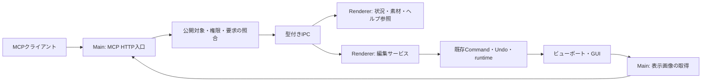

# MMD_modoki MCP操作・情報取得・ヘルプ設計

作成日: 2026-09-10。**実装前の具体設計案**。公開API名、初期値、数値上限は提案値であり、実装済み機能ではない。

同日、所有者が本設計の方向性を了承し、コミット・プッシュを指定した。実装時は本書を起点とし、APIの詳細と数値上限はクライアント互換性・実機検証に応じて調整する。

方式比較は[MCP連携方式の検討](./mcp-integration-design-investigation-2026-09-10.md)、最新仕様の根拠は[2026年最新動向](./mcp-2026-latest-findings-2026-09-10.md)に分離する。本書を今後の操作API・UI設計の参照先とする。

## 1. 今回の要求と体験の目標

所有者は、できるだけ最新仕様に沿ったMCP操作、ビューポートの見た目、読込済みモデル・ステージ・モーション等の元パス一覧、AIが機能を探せるヘルプ群を求めた。末尾の「ユーザーの体感外衣方がよい」は「ユーザーの体感がよい方」と解釈する。

目標は、**AIが現在のシーンを見て、機能を調べ、少ない往復で編集し、ユーザーが同じ画面で確認・Undoできること**。接続方式をユーザーが毎回意識したり、参照のたびに確認ダイアログが出たりする体験にはしない。

実装提案の要点:

- 標準MCPのローカルStreamable HTTP。2026-07-28仕様を主対象にし、SDKの2025年互換入口も試験する。
- 見た目・対象ID・読込元・編集状態を一緒に取得する「現在の状況」toolを入口にする。
- 公開toolは少数の編集意図に絞り、詳細説明は検索可能なローカルヘルプに置く。
- 既存GUIと同じ編集サービス・差分・Undoを使う。操作元を履歴と状態欄で確認できる。
- 接続先の登録は初回に行い、通常は実験設定のON/OFFで使う。登録の維持と、操作を許可する状態を分ける。

## 2. ユーザーから見える導線

「ツール → 実験設定…」へPBRとは独立した「AI連携（MCP）」欄を追加する。

```text
AI連携（MCP）                        [ OFF / ON ]
このウィンドウを接続先AIへ公開します。
画像・読込元パスの参照と、許可した編集ができます。

操作範囲   [ 参照のみ / 編集も許可 ]
接続先     登録したクライアント名
状態       接続待ち / 接続確認済 / 操作中 / 一時停止 / エラー

[接続設定…]  [最近の操作…]
```

通常の表示にはport・protocol版・tokenを出さず、「接続設定…」へまとめる。ここには接続先別の設定例、設定コピー、接続確認、登録解除を置く。OSや他アプリの設定ファイルを黙って書き換えない。

初期状態はOFF。最初にONにしたウィンドウだけを公開し、新しいプロジェクトやexport用の非表示ウィンドウは自動公開しない。初回設定で「参照のみ／編集も許可」を選び、そのクライアントの上限権限として記憶する。任意のfile書込や削除は初版の編集権限に含めない。

アプリ再起動後はOFFを既定とする。接続先登録は残し、ONで再利用する。「次回起動時にも有効」は初版では加えず、必要性を確認してからローカルアプリ設定として追加する。projectの保存・読込で連携をONにしない。

「接続確認済」は認証された要求に応答できた事実と最終時刻で示す。HTTP socketの有無や接続時に自己申告されたclient名を認証の証拠にしない。再接続が必要なclientには、その旨と具体的な再読込手順を表示する。

### 操作中の体験

- 下部の小さな状態表示に「AI: カメラを調整中」「AI: ポーズを変更しました」を出す。参照要求ごとのtoastは出さない。
- 300 msを超えた操作だけ進行中を表示し、長い処理は進捗・中止を提供する。数値は目標であり実測値ではない。
- 一回のポーズ編集は一回のUndoにする。履歴名は「AI: 左腕と表情を調整」のように変更内容を示す。
- 「AI操作を止める」で新規編集を停止し、待機中の編集を取り消す。参照を含め公開を止める操作は主スイッチのOFFとする。
- UIの手動編集を優先する。ドラッグ中などにAI要求が来たら短く待ち、解消しなければ`EDITOR_BUSY`を返す。長時間画面をロックしない。
- リバーシブルな編集を毎回ダイアログで確認しない。MCPクライアント自身の承認設定は尊重し、modokiから無効化しない。

## 3. 構成と寿命



Mainは認証・公開ウィンドウ・serverの寿命を管理する。Rendererがscene stateと履歴の正本を持つ。MCPのrequestごとに作られるserver instanceへ、sceneやUndoを保持させない。

公開対象は`editorSessionId`、読込世代は`sceneGeneration`、編集の競合検出は`editRevision`で表す。IDは認証の代用ではない。既存のmodel instance IDを使い、instance IDのないアクセサリ等には少なくとも世代内で安定したIDを割り当てる。配列indexをそのまま長寿命IDにしない。

Main単位のlistenerを共有する。公開ウィンドウが一つだけなら、最初の状況取得で自動選択できる。複数ある場合は一覧を返し、書込要求の暗黙のフォーカス追従はしない。以降のscene操作は必ず返されたtargetを渡す。

### 接続登録とON/OFF

体験をよくするため、以前の案の「OFFのたびに資格情報を作り直す」は採らず、次の二層に分ける。

| 状態 | 寿命 |
| --- | --- |
| クライアント登録・資格情報 | ローカルに保持。登録解除・漏えい時の再発行で失効 |
| このウィンドウへの操作許可・要求世代 | ON/OFF、権限変更、終了、renderer reloadで更新・失効 |

OFF中は保持した資格情報でもsceneへアクセスできない。ONへの再切替は既に登録したクライアントに、現在公開した対象への権限を与える。資格情報の保存はMain専用の保護されたアプリ設定とし、projectや通常ログへ含めない。

loopback専用、認証必須、Host/Origin検証は維持する。portは初回に確定した値を設定として保持する。競合時は別portへ無言で移動せず、接続設定の変更と再登録方法を表示する。新規待受の構築に失敗したらON表示へ進めない。

OFFで対象への受付を即停止し、未実行要求を破棄する。既に適用した短い編集は結果を確定して記録する。編集済み状態を自動でUndoしない。再ON後も古い世代の要求を実行しない。最後の公開ウィンドウがOFFならlistenerを閉じる。

## 4. AIが最初に使う入口

`mmd_get_context`を「何が読み込まれていて、何ができて、今どう見えるか」の入口にする。

初回は、公開対象、scene概要、素材件数、編集中/再生中の状態、Undo可否、ヘルプへの入口を返す。対象が一つなら、標準サイズのviewport画像も一枚返す。`includeViewport: false`なら画像取得を省略できる。

大きなモデルでも全ボーン名・全キー・全テクスチャを初回応答へ詰めない。素材・要素・キーの詳細はページ付きの一覧取得へ誘導する。ユーザーが「読込元を全部教えて」と頼んだ場合は、cursorを最後まで読む手順をヘルプに示す。

初回のscene概要は次を含む。

- `target`: editorSessionId、sceneGeneration
- `editRevision`、`assetRevision`、現在フレーム、再生状態、未登録編集の有無
- 材質モード（通常/PBR）、描画経路（FrameGraph/Classic）、viewportサイズ
- 読込中・export中・モーダル表示等の操作制約
- モデル/アクセサリ/モーション等の件数、選択対象のIDと表示名
- `helpUri`、API契約版、アプリ版、サポートされる操作カテゴリ

生成した表示名、モデルコメント、pathはデータとして扱い、server instructionsやヘルプの指示文へ混ぜない。

## 5. ビューポートの見た目を返す

### 既定は「現在見えている表示」

`mmd_capture_viewport`は、指定ウィンドウのviewport矩形をMainの`webContents.capturePage(rect, opts)`で取得する案を第一候補にする。背景・PostFX・ボーン表示等を含む、アプリ内で合成済みの表示を返す。OSデスクトップ全体の撮影は行わない。[Electron capturePage](https://www.electronjs.org/docs/latest/api/web-contents#contentscapturepagerect-opts)

PNG exporterを実行して代用すると、editor overlay、出力用設定、物理・時間評価の差が入り得る。既存の`ExportRenderSurface`は将来の出力画像tool向けに残し、`source: viewport`と`source: export-render`を区別する。

原則としてカメラ、現在フレーム、再生、選択、表示補助を変更しない。撮影のためにボーンを一瞬消す、ウィンドウを前面へ出す、export設定へ切り替える挙動は既定にしない。viewport上にアプリのモーダル等が重なる場合は状態を返し、隠れたモデルの画像だと偽らない。

### 鮮度と画像の返し方

- 画像は標準MCPの`ImageContent`で直接返す。ローカルPNGのパスだけを返してAI側の読出を期待しない。補助として期限付きの`mmd://captures/{captureId}`resourceを提供できる。[MCP tool結果](https://modelcontextprotocol.io/specification/2026-07-28/server/tools)
- 既定はPNG・長辺1280 px以下・拡大なし。上限案は長辺2048 px、応答全体8 MiB。上限超過時は縮小し、実寸を明記する。無制限の4K連続取得を既定にしない。
- `captureId`、撮影時刻、target、編集revision、画像寸法、通常/PBR、描画経路、補助表示の状態を返す。
- 停止中は、対象revisionの描画を要求し、表示反映の待機点を通ってから撮影する。`requestAnimationFrame`一回だけでGPU反映済みとは判定しない。compositorとの同期方法は実装試験で確定する。
- 再生中の撮影では勝手にpauseしない。取得前後のフレーム範囲と`consistency: live`を返す。正確な単一フレームが保証できない状態で、特定frameの画像と断定しない。
- 編集後の自動画像は、`appliedRevision`との対応を確認する。途中で手動変更が入ったら`SUPERSEDED`として返し、変更後の画像を元の編集結果と結び付けない。
- 最小化・reload・未描画等で新しい表示を得られなければ理由を返す。旧画像の利用は`allowStale`が明示されたときだけとし、撮影時刻とstaleを表示する。

viewport矩形のCSS座標・Electron座標・画面倍率の換算、ウィンドウのresize中、通常/PBR×FrameGraph/Classicは専用E2Eの確認点。数値metadataと画像の対応は実装前には保証しない。

### 応答性

画像取得はウィンドウごとに一件だけ実行する。同じrevision・同じ表示条件の同時要求は共有し、短時間に古くなった待機画像は作らない。停止中でも背景動画や時間依存effectがあるため、`editRevision`だけでは画像cacheを再利用しない。

通常の編集応答はJSONを返し、`returnViewport: true`を指定した編集のみ画像を添える。ヘルプの「ポーズ調整」では複数の数値を一回で変更し、最後に一枚撮る手順を勧める。

## 6. 読込素材と元パスの一覧

`mmd_list_assets`は**現在公開しているsceneが保持する参照情報**を返す。ディスク上のモデル探索やフォルダ走査はしない。要求された元パスは通常の一覧項目として省略せず返す。

対象カテゴリは、モデル、アクセサリ（ステージを含む）、モデルモーション、カメラモーション、VPD、音声、背景画像/動画、環境画像、外部LUT。内蔵素材・生成データもsource種別を明示して扱う。テクスチャ依存一覧は大きくなりやすいため、初版の必須一覧から分離し、対応時に`includeDependencies`で取得する。

| フィールド | 意味 |
| --- | --- |
| `assetId` | 同一scene generation内で安定した参照ID |
| `kind` / `format` | model / accessory / model-motion等とPMX / X / VMD等 |
| `displayName` | 表示用。IDや命令に使わない |
| `usageRole` | character / stage / prop / unknown。形式や名前から断定しない |
| `source.kind` | file / embedded / builtin / generated / unknown |
| `source.recordedPath` | 現在の読込管理・projectに保持された参照文字列。相対pathも保持 |
| `source.resolvedPath` | 現在の基準directoryで解決できた絶対path。解決不能ならnull |
| `source.importedFromPath` | 最初の読込時のpathを記録できた場合のみ。過去の移動前pathを推測しない |
| `source.availability` | unchecked / present / missing / inaccessible / not-applicable |
| `uses` | model instance ID等の適用先、用途、取込順、VPDの適用frame |
| `contentState` | imported / edited / merged / embedded-restored / unknown。分かる範囲で返す |

ユーザーのいう「元パス」は`recordedPath`と`resolvedPath`で返せる。取り込み当時のpathと現在解決したpathが異なる場合も、それぞれの意味を説明する。旧projectに残っていない履歴はnullまたはunknownにする。

PMXをステージとして使う場合も、Xを小道具として使う場合もある。初版はmodel/accessoryを全件列挙し、役割未設定を`unknown`とする。「ステージ一覧」のフィルターで未知の候補を黙って除外しない。将来役割ラベルを追加するなら別途UI・project保存を設計する。

### モーションの由来と現在の内容

既存実装はVMD/BVMDを合成し、VPDの適用frameも記録する。さらにproject内に編集済みanimationを保存できる。そのため`MotionInfo.path`一件だけでは全由来を表せない。

`motionImports`を取込順に列挙し、適用先model instance IDと紐付ける。同じfileを同じモデルへ複数回使った場合は`uses`を分ける。ファイルごとの現在の寄与範囲を証明できない場合は`contribution: unknown`とする。

「元ファイルを再読込すれば現在のモーションになる」とは説明しない。project埋込animationから復元されていれば、その状態と参照元を分ける。手動編集・キー削除・合成後の状態を知るには`mmd_inspect`で現在のtrackを読む。

既定では存在確認を行わない。読込済みであることは、元ファイルが今も存在することの証明にならない。`checkAvailability: true`だけMainで非同期に確認し、timeoutを設ける。UNC等の遅い参照でUIを止めない。

一覧は既定100件、最大500件でページ化し、`assetRevision`に結び付くcursorを使う。途中で読込・削除されたら`CURSOR_STALE`と再取得方法を返す。同じpathのモデルを重複削除して一個に見せない。fileの内容を返す権限はpath一覧の参照と別にする。

返却例（架空のpath・ID。MCPのwire envelopeを省略したアプリDTO）:

```json
{
  "assetId": "asset-motion-03",
  "kind": "model-motion",
  "format": "vmd",
  "displayName": "walk.vmd",
  "usageRole": "unknown",
  "source": {
    "kind": "file",
    "recordedPath": "../motions/walk.vmd",
    "resolvedPath": "D:/MMD/motions/walk.vmd",
    "importedFromPath": null,
    "availability": "unchecked"
  },
  "uses": [
    { "modelInstanceId": "model-02", "importOrder": 1, "contribution": "unknown" }
  ],
  "contentState": "embedded-restored"
}
```

この例はproject内のanimationを復元済みで、VMDは由来として保持されている状態。fileの存在も現在のキーとの一致も保証していない。

## 7. AIが機能を探せるヘルプ

### 入口と配置

`mmd_help`は引数なしで開始ガイド、`query`で検索、`topicId`で本文を返す。queryとtopicIdは同時指定しない。検索は同梱データに対して行い、外部検索・API・embedding serverを必要としない。

同じ本文を`mmd://help/{topicId}`というMCP Resourceでも公開する。Resourcesの自動読込をclientがしない場合でもtool経由で読める。両経路は同じhelp serviceを使う。[MCP Resources](https://modelcontextprotocol.io/specification/2026-07-28/server/resources)

Promptsは将来「ポーズ調整」「カメラ構図比較」などの利用者が選ぶ手順テンプレートに使えるが、ヘルプを読む唯一の入口にはしない。[MCP Prompts仕様ソース](https://raw.githubusercontent.com/modelcontextprotocol/modelcontextprotocol/main/docs/specification/2026-07-28/server/prompts.mdx)

### ヘルプの構成

| topic | 内容 |
| --- | --- |
| `getting-started` | 状況取得→対象選択→操作→画像確認→Undo |
| `capabilities` | 機能カテゴリ、対応tool、現在版での公開状態 |
| `assets-and-paths` | モデル・ステージ・モーションの由来とpathの意味 |
| `viewport` | 表示画像と出力画像、鮮度、補助表示、再生中の制約 |
| `pose` / `camera` / `materials` / `keyframes` | 実際の編集方法、単位、制限、例 |
| `preview-and-keys` | 未登録編集、キー登録、seek・再読込時の扱い |
| `undo-and-conflicts` | Undo、手動操作との競合、再試行 |
| `errors` | エラーcodeからの復帰方法 |

各記事は機能ID、短い説明、日本語/英語の別名、tool名、入力例、前提条件、Undo可否、保存との関係、関連項目、GUI上の入口を持つ。

たとえば「材質を消す」「表示切替」「material visibility」で同じ項目が見つかり、`visible: false`と`alpha: 0`の違い、通常/PBRの対応、該当toolが未実装ならその状態も返す。UIに存在するだけの機能をMCPで呼べるように装わない。

`status`はimplemented / planned / unsupported、実行時の`availability`はready / blocked / mode-requiredで分ける。plannedな機能は検索結果に出ても、実行可能なtool名として登録しない。解除方法もhelpへ含める。

### 情報量と保守

検索結果は既定5件・最大20件。要約と記事IDを返し、必要な本文だけ読む。初回server説明は入口tool・対象ID・編集の基本に絞る。全docsや全API定義を毎回model contextへ入れない。

toolのschema、summary、scope、availability、Undo対応、help IDを一つの`AutomationCapabilityRegistry`で定義する。説明本文は同梱の日本語/英語資料として持ち、機械的な項目はregistryから生成する。GUIのlabel文言を実行キーにしない。

ヘルプとtool schemaは同じアプリ版のpackageへ固定する。実装していないtoolへのリンク、例の入力不正、未定義help IDをbuild時の検証で落とす。

## 8. 最初に公開するtool契約

以下は全て提案。初版で実装完了したものだけを`tools/list`へ登録する。queryとeditingを同じ任意実行toolにまとめない。

| tool | 用途 | 初版 |
| --- | --- | --- |
| `mmd_get_context` | 公開対象とsceneの概要、任意の画像 | 必須 |
| `mmd_list_assets` | 読込元path・適用先・source種別 | 必須 |
| `mmd_capture_viewport` | 現在のviewport画像 | 必須 |
| `mmd_help` | 機能検索と説明取得 | 必須 |
| `mmd_inspect` | 対象IDを指定したボーン/モーフ/材質/trackのページ付き参照 | 必須 |
| `mmd_set_playback` | play / pause / seekの明示操作 | 必須 |
| `mmd_set_camera` | カメラ編集・任意のキー登録 | 必須 |
| `mmd_apply_pose` | 複数ボーン・モーフの一括編集・任意のキー登録 | 必須 |
| `mmd_get_operation` | operation IDの受付・適用・失敗・画像状態を照会 | 必須 |
| `mmd_undo` | 指定AI編集を履歴末尾から取り消す | 必須 |
| `mmd_set_material` | 材質の表示・preset等。通常/PBRを確認 | 次段階 |
| `mmd_edit_keyframes` | 既存キーの範囲編集 | 次段階 |
| 読込・保存・出力tool | file操作と長時間job | 次段階 |

ボーン・モーフIDの列挙は`mmd_inspect`へまとめるが、返却型はkind別のschemaで固定する。名前が重複するときに最初の一件へ暗黙適用しない。

### 編集要求と返却

sceneへの書込にはtarget、`expectedEditRevision`、アプリ用`operationId`を付ける。`mode: preview | keyframe`を明示し、省略して保存意図を推測しない。位置・回転・frameの単位と座標系をschemaへ書く。カメラの中心座標とeye座標を混ぜない。

モーションを再生中に編集する要求は、`playbackPolicy: pause | reject`を明示する。体験重視の手順例ではpauseを使い、現在位置で一度だけ停止してから編集し、停止したことを結果・UIへ表示する。勝手にseekしたり、完了後に再生を再開したりしない。純粋な参照toolではこの処理を行わない。

編集サービスはavailabilityを再検査し、全項目の事前検証、差分生成、短い排他区間での適用、履歴追加、UI更新要求の順で処理する。途中失敗の復元を保証できない混在操作を一括toolへ含めない。手動編集とMCP編集が同じrevisionを更新する。

一回のポーズで編集する対象数の上限案は256。超過時は途中まで適用せず、必要な分割方法を返す。長い非同期処理をUndo transactionに抱え込まない。

返却は`operationId`、applied / no-change / rejected / pending、before/after revision、変更の短い要約、Undo用edit ID、必要ならcapture情報。標準MCPの構造化結果と互換用textを使い、wire上の`resultType`等はSDKに任せる。

**編集成功と画像成功を分ける。** 変更後の撮影だけ失敗しても編集を失敗扱いにせず、`edit: applied, capture: failed`を返す。AIは画像だけを再要求できる。タイムアウト時もoperation IDで照会してから再試行する。

この場合のMCP応答は`isError: false`とし、構造化結果のcapture失敗と再取得手順を示す。編集自体が拒否・失敗したときに`isError: true`を使う。画像失敗を理由に同じ編集を新しいoperation IDで再実行しないことをヘルプ例でも説明する。

同じoperation IDと同じ入力の再要求は、保持期間内なら同じ編集結果を返す。別入力でのID再利用は拒否する。新しいscene generationでは古い操作を再実行しない。履歴保持期限外・アプリ再起動後など結果を確認できない場合はunknownを返し、exactly-onceを無条件には保証しない。

`mmd_undo`は指定edit IDが履歴末尾にある場合のみ取り消す。間に手動編集が入っていれば、その手動編集まで黙って戻さない。

### エラーから次の操作へ進める

エラーは短いcode・説明・現在状態・次に使うtool/helpを返す。例:

| code | AIへの次の案内 |
| --- | --- |
| `REVISION_CONFLICT` / `SCENE_CHANGED` | contextを取り直して編集内容を再評価 |
| `EDITOR_BUSY` | 手動操作または出力の終了後に再試行 |
| `MODE_REQUIRED` | 必要な通常/PBR等の状態と関連help |
| `CAPTURE_UNAVAILABLE` / `SUPERSEDED` | 編集は再実行せず、画像またはcontextを再取得 |
| `ASSET_SOURCE_UNKNOWN` | 現在の保持情報を返し、元pathを推測しない |
| `MCP_DISABLED` / `ACCESS_REVOKED` | ユーザーがアプリ側で公開を再開するまで待つ |

エラー応答へ秘密情報や巨大なstackを載せない。認証失敗時はscene名・pathも返さない。

## 9. 既存コードとの差分と実装境界

| 既存箇所 | 確認した状態 | 追加するもの |
| --- | --- | --- |
| `src/types.ts` | ModelInfoにinstanceId/path、MotionInfoにpath、ProjectMotionImportにtype/path/frame | 読込参照を表す軽量DTO |
| `src/assets/motion-asset-service.ts` | VMD/BVMD合成とimport記録、VPDのframe記録 | 新規読込のprovenance通知と照会 |
| `src/project/project-serializer.ts` / importer | model motionImports、camera/audio、accessory等のpathを保持。埋込animation復元あり | 元pathと現在内容を分離したquery。project全体のserializeを一覧取得に流用しない |
| `src/main.ts` | smokeでcapturePageを使用。export用windowも作成 | 公開editor registry、viewport領域のcapture service |
| `src/renderer.ts` | E2E専用hookあり | 本番用の型付きautomation bridge。E2E hookを一般公開しない |
| `src/render/export-render-surface.ts` | 出力向けRGBA取得 | viewport取得と用途を分離。初版の表示取得で出力renderを起動しない |
| `src/actions/` | 差分・履歴、handler受付boolあり | 完了結果を返すautomation編集窓口、競合検出 |
| `src/ui/experimental-settings-dialog-controller.ts` | 実験設定の既存入口 | AI連携欄、Main状態の反映 |

新規責務は`src/automation/`にcontract・registry・query・edit service、`src/main/automation/`にserver・認証・window registry・capture、`src/automation/help/`に同梱ヘルプを置く案。ファイル構成は既存buildとの適合を実装時に確認する。

元pathの一覧取得で、全animation配列のserialize、texture readback、ファイルhash計算を行わない。必要なら読込/削除/復元時に更新する軽量な参照indexを持ち、正本と二重に編集しない。

## 10. 確認と段階導入

| 段階 | 完了条件 |
| --- | --- |
| A: 接続・観測・ヘルプ | 実験設定ON/OFF、同じ登録で再接続、context、全素材の元path、viewport画像、help検索を実clientから使える |
| B: 編集 | カメラ・ボーン・モーフ・preview/キー登録、画像と編集結果の分離、Undo、競合処理が一続きで動く |
| C: 制作機能拡張 | 材質、キー範囲編集、許可したfile操作・出力jobを追加 |
| D: 任意拡張 | client/SDK対応を確認したTasks、MCP Apps、WebMCP等のadapter |

最初に使える版の範囲はA+B。Aだけで「MCPから制作操作できる版」とは扱わない。

unitはID/世代/revision、元pathと使用箇所の関連付け、null/埋込データ、help例のschema、差分とUndo、二重適用防止を確認する。HTTP integrationは2026方式と2025互換、認証・失効、画像Content、ページング、エラー契約を確認する。

GUI E2Eは配布可能fixtureを使い、通常/PBR×FrameGraph/ClassicでMCPからカメラ・ポーズを変更し、UIの値と実画像・Undoを確認する。元pathは同名モデル二個、PMXステージ候補、X/OBJアクセサリ、複数モーション、VPD、project埋込復元、元file欠落を含める。モデル所有物の探索は行わない。

接続登録を保ったOFF→ON、古い要求の拒否、複数window、reload、最小化、倍率変更、再生中capture、手動ドラッグ競合、編集成功後のcapture失敗も確認する。Electron/WebGPU試験はsandbox外のGPU利用可能なGUI環境で行う。

体感の測定目標は、通常規模のsceneで軽量queryのp95が200 ms以内、停止中1280 px captureのp95が1秒以内。主スイッチOFFの受付停止は次の要求から有効にする。これは合格を主張する数値ではなく、実装時に代表sceneと計測区間を固定して検証する目標。達成できない場合は重い処理を切り分け、UIをブロックせず待機状態を返す。

今回行ったのは既存コード・公式仕様の照合と本設計の作成。runtime実装、資格情報の作成、MCP接続、画像取得E2Eはまだ行っていない。
