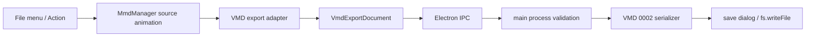

# VMD 書き出し β 実装ガイド 2026-08-14

対象: `MMD_modoki` / `babylon-mmd 1.2.0` / 標準 VMD 0002

## 1. この文書の目的

本書は、2026-08-14 に追加したモデル／カメラ VMD 書き出しβ版について、実装の流れと保守時の注意点を説明する。

- バイナリ形式と検証規則の完全な定義は [VMD 出力実装仕様](./vmd-export-implementation-spec.md) を参照する。
- 実装前に確認した babylon-mmd の仕様と一次情報は [VMD 出力 / babylon-mmd 1.2.0 調査メモ](./vmd-export-babylon-mmd-research-2026-08-14.md) を参照する。
- 本書は「現在のコードが、どの責務をどこで実行しているか」を案内する実装ガイドとして扱う。

VMD には公開された公式仕様書がない。自動テストと babylon-mmd の読み戻しは完了しているが、MMD 本家での代表ファイル読み戻しは未実施である。このため機能名には `(β)` を付け、「MMD 完全互換」とはまだ表現しない。

## 2. 現在のユーザー向け機能

「ファイル」メニューに次の2項目を追加した。

- `モデルモーション書き出し (β)...`
- `カメラモーション書き出し (β)...`

モデルとカメラは別々の `.vmd` として保存する。単一ファイルへ混在させない。

### モデル VMD

選択中モデルの source animation から次を出力する。

- Bone key: 位置、回転、4チャンネルの補間、物理 ON/OFF
- Morph key: ウェイト
- Property key: モデル表示、IK ON/OFF

Camera、Light、Self-shadow の count は `0` にする。

### カメラ VMD

現在の camera source animation から次を出力する。

- 注視中心位置
- Euler回転
- 距離
- FoV
- 位置X/Y/Z、回転、距離、FoVの6補間チャンネル

Bone、Morph、Light、Self-shadow、Property の count は `0` にする。projection byte は透視投影 ON を表す `0x00` に固定する。

### 出力しない情報

- 照明キー
- セルフ影キー
- 重力と物理world設定
- モデル／カメラ外部親
- アクセサリ、背景、PostFXなどのproject state
- 物理計算後のruntime姿勢のbake

外部親キーが存在するときは、黙って互換であるように見せずwarningを返す。world-space bakeは別機能として設計する。

## 3. 実装全体のデータフロー

重要なのは、rendererからバイナリを送らず、通常の配列・文字列・数値だけで構成した `VmdExportDocument` を送る点である。main process はrendererを信頼せず、documentを再検証してからShift-JIS化とバイナリ化を行う。

## 4. ファイルと責務

| ファイル | 現在の責務 |
| --- | --- |
| `src/export/vmd-export-document.ts` | IPC可能な中間document、issue、保存結果、共通定数 |
| `src/export/vmd-export-adapter.ts` | babylon-mmd trackを中間documentへ正規化 |
| `src/export/vmd-export-validator.ts` | frame、stride後の値、名前、補間、重複などの検証 |
| `src/export/shift-jis-fixed-string.ts` | Shift-JIS変換、固定長padding、文字境界truncation、byte key生成 |
| `src/export/vmd-serializer.ts` | VMD 0002のlittle-endian byte列生成 |
| `src/mmd-manager.ts` | 選択中モデル／カメラのsource animation公開とavailability判定 |
| `src/ui-controller.ts` | Action handler、model header取得、adapter呼び出し、結果通知 |
| `src/main.ts` | IPC入力再検証、save dialog、ファイル保存、structured log |
| `src/preload.ts` / `src/types.ts` | 型付きIPC境界 |
| `src/ui/app-menu-controller.ts` | メニューの有効／無効とAction dispatch |

binary layoutやShift-JIS処理を `UIController` や `MmdManager` へ混ぜない。この分離により、DOMやBabylon runtimeなしでwriterを単体テストできる。

## 5. source animationを出力する理由

VMD書き出し元は、現在画面に見えているtransformではなく、編集対象として保持している `MmdAnimation` である。

- モデル: `modelSourceAnimationsByModel.get(currentModel)`
- カメラ: `cameraSourceAnimation.cameraTrack`

runtime transformを直接読むと、次が混ざる可能性がある。

- 再生途中の補間結果
- 物理演算結果
- 外部親適用後の一時姿勢
- Babylon側のruntime座標変換

交換用VMDには「登録されたキー」を書く必要があるため、source trackを正とする。現在の出力はruntime姿勢をサンプリングするbake exporterではない。

## 6. adapterの仕事

`createModelVmdExportDocument()` と `createCameraVmdExportDocument()` は、babylon-mmdのTypedArrayをserializerが扱いやすいkey単位へ展開する。

### モデル

`boneTracks` と `movableBoneTracks` は、どちらもVMDのBone sectionへflattenする。

- 通常Bone trackには位置がないため `[0, 0, 0]` と線形位置補間を補う。
- Movable Bone trackは位置と位置補間を保持する。
- quaternion、回転補間、物理toggleは両方で保持する。
- MorphとPropertyもframe単位のkeyへ展開する。

異なるtrackから展開したkeyは、frame、元track順、元key順で決定的にsortする。同じ入力から常に同じbyte列を得るためである。

TypedArrayの長さは暗黙に信用しない。たとえばcamera positionなら `frameCount * 3`、Bone rotationなら `frameCount * 4` であることを検査する。物理、表示、IKのflagは `0` または `1` 以外を拒否する。不正なstrideを既定値で埋めて保存しない。

### カメラ

カメラtrackの値は座標変換せず、そのままコピーする。

- `positions` はVMDの注視中心
- `rotations` はradianのraw Euler値
- `distances` はVMD用の符号をすでに持つため再反転しない
- `fovs` はserializerで `uint32` に丸める

読み込み時に行った変換をwriter側で推測して重ねると、左右反転やclose-upの再発につながる。camera adapterはraw track valueの保存に限定する。

## 7. VmdExportDocumentを挟む理由

serializerが `MmdAnimation` を直接受けない設計には、次の利点がある。

- Babylon runtime classをIPCへ渡さずに済む
- 入力をplain dataへ固定できる
- adapterの変換ミスとserializerのbyte配置ミスを別々にテストできる
- 将来、別の編集データ源からも同じwriterを使える
- main processで同じdocumentを再検証できる

モデル用とカメラ用はdiscriminated unionの `kind` で分ける。モデルdocumentにはcamera keyを持たせず、カメラdocumentにはmodel keyを持たせない。

## 8. Shift-JIS固定長文字列

標準VMDの文字列はUTF-8ではない。`TextEncoder` は使わず、direct runtime dependencyにした `iconv-lite` でShift-JISへ変換する。

固定長は次のとおり。

| field | byte数 | 方針 |
| --- | ---: | --- |
| header model name | 20 | 文字境界でtruncateしwarning |
| Bone name | 15 | 超過をerror |
| Morph name | 15 | 超過をerror |
| Property IK Bone name | 20 | 超過をerror |

Binding nameを黙ってtruncateすると、別名が同じ15 bytesへ化けて誤ったボーンへ適用される恐れがある。このためBone、Morph、IK名は保存を拒否する。header model nameだけはMMDの慣行に合わせて文字境界でtruncateし、warningを返す。

Unicode文字が `?` へ代替された場合も保存を拒否する。ただし元からliteral `?` だった場合は正しい文字として扱う。

## 9. serializerと壊れやすいbyte規則

`serializeVmd()` はvalidation成功後のdocumentから、little-endianのVMD 0002を生成する。未対応sectionも省略せず、Property sectionまでcountを書いた完全な構造にする。

### Bone補間64 bytes

babylon-mmdのtrackは4本のBezierを正規化された16 bytes相当として持つが、VMD Bone keyは冗長な64-byte配置を要求する。`createBoneInterpolationBytes()` がこの再配置を一か所で担当する。

物理toggleもこの64 bytes内の予約位置へ入る。

- 物理 ON: `00 00`
- 物理 OFF: `63 0f`

この規則は通常の補間byteとは独立して見えるが、VMD互換上は同じ64-byte blockの一部である。一般化した行列変換へ置き換えず、exact-byte testと一緒に保守する。

### Camera

Camera keyは61 bytesで、補間の順序を次に固定する。

1. position X
2. position Y
3. position Z
4. rotation
5. distance
6. FoV

FoVは有限値を確認し、`Math.round()` 後の値をlittle-endian `uint32` で書く。値が変わる場合は `camera_fov_rounded` warningを返す。projection byteは `0x00` 固定である。

## 10. fail-closed validation

半端なVMDを他ツールへ渡さないため、修復できると明確に決めた項目以外は保存を拒否する。

主なerror条件:

- 空モーション
- frameが整数の `uint32` ではない
- NaN / Infinity
- trackの配列長不一致
- 補間値が整数 `0..127` ではない
- 同じbindingとframeの重複
- PropertyまたはCameraの同一frame重複
- Shift-JIS変換不能
- Binding nameの固定長超過
- Shift-JIS固定byte列の名前衝突
- flagが `0 / 1` 以外

warningで保存を継続する項目:

- header model nameの20-byte truncate
- fractional FoVの丸め
- Morph weightが通常範囲 `0..1` の外
- 外部親キーを標準VMDへ反映できない
- PMX / PMD内部モデル名を取得できず表示名へfallback

`saved`、`cancelled`、`invalid`、`failed` は別結果として扱う。cancelは失敗通知を出さない。

## 11. UI、Action、IPC

追加Action:

- `project.exportModelVmd`
- `project.exportCameraVmd`

モデルに書き出せるBone／Morph／Property keyがない場合、またはCamera keyがない場合は、対応メニューを無効にする。Actionが直接dispatchされた場合にも同じ条件を再確認する。

モデルheader名は、保存時に `readMmdModelHeader()` でPMX / PMD内部名を取得する。取得できない場合はモデル表示名へfallbackし、warningとしてlogへ残す。カメラheaderは常に `カメラ・照明` である。

rendererは中間documentと既定ファイル名を `file:saveVmd` へ渡す。main processは次の順で処理する。

1. documentを再検証してserialize
2. invalidならsave dialogを開かず終了
3. 既定名をsanitize
4. save dialogを表示
5. `.vmd` 拡張子を保証
6. `fs.writeFile`
7. key数、byte数、warning codeをstructured logへ記録

## 12. 自動テスト

### Pure unit test

`test/export/shift-jis-fixed-string.test.ts`:

- `カメラ・照明`のcanonical byte列とpadding
- Unicode変換不能
- literal `?`
- 文字境界truncate
- fixed-byte key

`test/export/vmd-export-adapter.test.ts`:

- Model trackのflattenと決定的sort
- 物理／IK保持
- Camera raw valueの非変換
- stride不一致と不正binary flagの拒否

`test/export/vmd-serializer.test.ts`:

- Bone補間64 bytesと物理toggleのexact bytes
- 全section countとfile length
- Camera補間順、FoV、projection byte
- Morph／Property／IKの可変長配置
- 不正名、重複、空motionの拒否
- 外部親warning
- babylon-mmd `VmdLoader`によるモデル／カメラsemantic round-trip

### Action / E2E

- `test/actions/action-availability.test.ts` でkey有無によるAction availabilityを確認する。
- `test/e2e/vmd-export.spec.mjs` でElectronを起動し、モデル／カメラkey登録、メニュー状態、実ファイル保存、section countと主要byteを確認する。

2026-08-14時点の確認結果:

- `npm.cmd run test:unit`: 68 files / 421 tests passed
- `npm.cmd run lint`: passed
- `npm.cmd run typecheck:critical`: critical errorなし
- `npm.cmd run smoke:launch`: WebGPU renderer初期化までpassed
- `npm.cmd run test:e2e -- vmd-export.spec.mjs`: passed

通常の `typecheck` には本機能とは別の既知errorが残る。critical gateである `TS2304` / `TS2552` は検出されていない。

## 13. 保守時の確認順

### adapterを変更した場合

1. TypedArray strideを確認する
2. 座標、回転、距離の追加変換がないか確認する
3. adapter unit testを更新する
4. serializer round-tripを実行する

### binary layoutを変更した場合

1. byte offsetと総file lengthを紙上でも再計算する
2. exact-byte testを先に更新する
3. `VmdObject.ParseFromBuffer()` と `VmdLoader` の両方で読み戻す
4. MMD本家のfixture確認結果を残す

### 名前処理を変更した場合

1. 文字数ではなくShift-JIS byte数で確認する
2. multibyte文字の途中で切らない
3. Binding nameを黙ってtruncateしない
4. encode後の名前衝突を確認する

### UIやIPCを変更した場合

1. keyなし時のdisabled状態
2. renderer側guard
3. main process側validation
4. cancelとerrorの通知差
5. focused E2E

## 14. β解除までの残作業

MMD本家で最低限、次のfixtureを読み戻す。

- Model: Bone回転、Movable Bone位置、Morph、表示、IK
- 物理ON/OFFを含むBone key
- Camera: 中心、回転、距離、FoV、6補間
- 日本語モデル名
- Shift-JIS 15-byte境界付近のBone／Morph名

確認記録には日付、MMD version、fixture名、確認項目、OK／NGを残す。不一致が出た場合は、見た目だけで補正せず、raw byte、babylon-mmd読み戻し値、MMD本家の観測値を並べて原因を切り分ける。

β解除条件は [VMD 出力実装仕様の完了条件](./vmd-export-implementation-spec.md#17-完了条件) を正とする。
